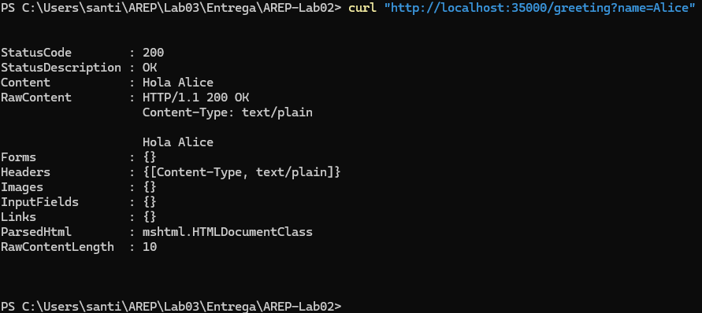
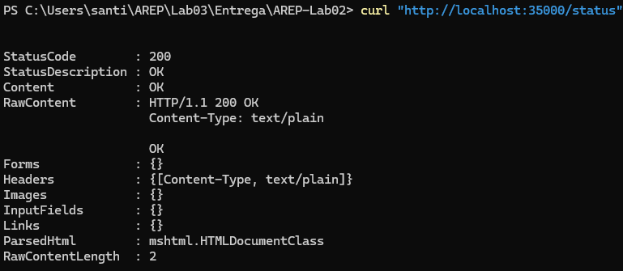

Aquí tienes el README con emojis y un formato más atractivo, similar al que compartiste:

---

# 🚀 WebServer: Lightweight Java HTTP Server with Annotation-Based Routing

📌 **WebServer** is a lightweight Java HTTP server that supports annotation-based routing using custom `@RestController`, `@GetMapping`, and `@RequestParam` annotations. This project provides dynamic request handling, static file serving, and built-in endpoints to demonstrate its functionality.

---

## ✨ Features

✅ **Annotation-based request mapping** (`@GetMapping`, `@RequestParam`, `@RestController`).  
✅ **Dynamic query parameter handling**.  
✅ **Static file serving** (HTML, CSS, JS, images).  
✅ **Custom `Request` and `Response` classes** for HTTP interactions.  
✅ **Singleton service (`WebService`) for resource management**.  
✅ **Easy-to-extend controller system**.

---

## 🚀 Getting Started

### 🛠 Prerequisites

🔹 Java 8 or higher  
🔹 Maven (optional, if you want to build a package)

### 📥 Installation

1️⃣ **Clone this repository**
   ```sh
   git clone https://github.com/your-username/WebServer.git
   cd WebServer
   ```  
2️⃣ **Compile and run the project**
   ```sh
   mvn clean install
   ```  

### ▶️ Running the Server

Execute the following command to start the server:

```sh
java -cp target/classes webapp.App
```

🔹 By default, the server runs on **port 35000**.  
🔹 It will automatically scan and register controllers.

---

## 🖥 Usage

### 🌐 Default Endpoints

| 🌍 **Endpoint**  | 🔄 **Method** | 📥 **Parameters**         | 📋 **Description**                                   |
|-----------------|--------------|--------------------------|-----------------------------------------------------|
| `/greeting`     | GET          | `name` (optional)        | Returns `"Hola {name}"` (default: `"Hola World"`)  |
| `/pi`          | GET          | None                     | Returns the value of π (`3.141592653...`)          |
| `/time`        | GET          | None                     | Returns the current system time ⏰                 |
| `/status`      | GET          | None                     | Returns `"OK"` ✅ (server health check)           |
| `/author`      | GET          | None                     | Returns `"Santiago Guerra Penagos"` ✍️            |
| `/version`     | GET          | None                     | Returns Java and server version info 🏷️           |

---

## 🛠 Example Usage

📌 **Retrieve a greeting message:**
```sh
curl "http://localhost:35000/greeting?name=Alice"
```  


📌 **Get the server status:**
```sh
curl "http://localhost:35000/status"
```  

---

## 📂 Project Structure

```
WebServer/
├── src/
│   ├── webapp/
│   │   ├── App.java             # Application entry point
│   │   ├── WebServer.java       # HTTP server
│   │   ├── controller/          # Application controllers
│   │   │   ├── WebController.java
│   │   ├── services/            # Business logic and request/response handling
│   │   │   ├── Request.java
│   │   │   ├── Response.java
│   │   │   ├── WebService.java
│   │   │   ├── RESTInterface.java
│   │   ├── annotations/         # Custom annotations
│   │   │   ├── GetMapping.java
│   │   │   ├── RequestParam.java
│   │   │   ├── RestController.java
├── resources/                   # Static files
│   ├── index.html               # Home page
│   ├── 404.html                 # 404 error page
│   ├── home.html                # Another HTML page
│   ├── home.js                  # Website JavaScript
│   ├── 404.css                  # Error page styles
│   ├── 404.png                  # Error image

```

---

## ⚡ Customization

### ➕ Adding a New Endpoint

To add a new **GET endpoint**, follow these steps:

1️⃣ Create a new method inside `WebController` (or any controller class):
   ```java
   @GetMapping("/hello")
   public String hello(@RequestParam(value = "name", defaultValue = "Guest") String name) {
       return "Hello " + name;
   }
   ```  

2️⃣ Restart the server and access:
   ```
   http://localhost:35000/hello?name=John
   ```  

---

## 🖼 Static File Serving

Place your static files in `src/main/resources/`. The server will **automatically serve them**.

📌 Example:
- `http://localhost:35000/index.html` → Serves `src/main/resources/index.html`
  - It is important to know that by default, the server will serve the `index.html` file if no path is specified. 
- `http://localhost:35000/style.css` → Serves `src/main/resources/style.css`

---

## **👨‍💻 Author**
Developed by **Santiago Guerra Penagos**.

🔹 GitHub: [Sguerra1702](https://github.com/Sguerra1702)  
🔹 Email: santiago.guerra@mail.escuelaing.edu.co